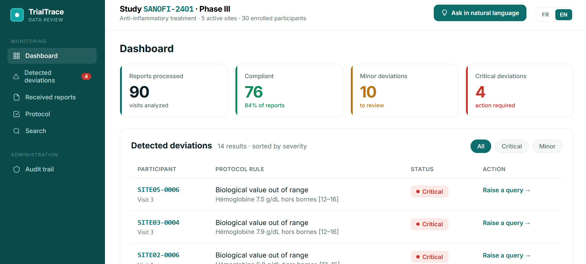

# TrialTrace

🇫🇷 [Lire en français](README_fr.md)

**Cloud-native clinical data review and protocol-compliance platform**

TrialTrace is a portfolio project exploring how modern cloud, AI and deterministic rules can support clinical-data review. It centralizes structured study data, surfaces protocol deviations by severity, validates AI-extracted data before use, and enforces role-based access with a full audit trail.

> **Data policy:** all data used in TrialTrace is synthetic. No real patient data is used.

## Dashboard preview



## The problem

Clinical-study review can involve information scattered across reports, sites and systems. This makes it harder to identify important deviations quickly, prioritize critical cases and preserve a clear, attributable review trail.

TrialTrace explores a workflow where teams can:

- review study-level indicators at a glance;
- distinguish compliant records, minor deviations and critical deviations;
- extract structured information from free-text reports, with deterministic validation;
- search participants and review their full visit history;
- configure protocol rules and see deviations recompute in real time;
- ask questions in natural language over the study data;
- work in French or English;
- apply different, server-enforced permissions for data managers and auditors;
- trace every sensitive action in an audit trail.

## Architecture

``` text
                         ┌──────────────────────┐
                         │   React / TypeScript │
                         └──────────┬───────────┘
                                    │
                           CloudFront / HTTPS
                                    │
                              Private S3 (OAC)
                                    │
                                    ▼
                              API Gateway
                        (Cognito JWT authorizer)
                                    │
                 ┌──────────────────┴──────────────────┐
                 │                                      │
              Lambda                                Cognito
                 │                                Auth / RBAC
        ┌────────┼─────────┐
        │        │         │
    DynamoDB  Bedrock   OpenSearch
```

Infrastructure is managed with Terraform. Frontend deployment is automated through GitHub Actions using AWS OIDC federation.

## Features

- React + TypeScript frontend deployed through CloudFront with a **private S3 origin and OAC**.
- Terraform-managed AWS infrastructure with **remote encrypted/versioned state in S3**.
- API Gateway + Lambda serverless backend.
- DynamoDB-backed dashboard with synthetic clinical-study data.
- Severity dashboard showing compliant, minor and critical records.
- **Amazon Bedrock extraction** turning free-text clinical reports into structured JSON, with **deterministic validation** — invalid values are rejected, not propagated.
- **OpenSearch full-text search** over participants (SigV4-signed requests).
- **Deterministic compliance engine** validated against a known synthetic dataset (14 injected anomalies detected, 0 false positives).
- **Configurable protocol** stored in DynamoDB — editing a rule recomputes deviations and statistics in real time.
- **Natural-language querying** via LLM function calling: the model picks from safe, read-only operations that deterministic code executes.
- **Bilingual UI (French / English)** with a live language switch.
- **Cognito authentication** with `data-manager` and `auditor` roles.
- **Server-side RBAC**: the API validates the Cognito JWT and the role; forbidden actions return `403` even if the UI is bypassed.
- **Idle auto-logout** after inactivity.
- **ALCOA+ audit trail**: every protocol change and query is recorded (who / what / when), append-only, filterable by action and by user.
- **Deviation table pagination** and a **participant-detail view** with full visit history.
- GitHub Actions CI/CD authenticated to AWS through **OIDC — no long-lived AWS deployment credentials stored in GitHub**.

## AI safety boundary

TrialTrace deliberately separates probabilistic extraction from deterministic validation:

``` text
Clinical text
     │
     ▼
Amazon Bedrock / LLM
     │ extracts
     ▼
Structured JSON
     │
     ▼
Deterministic validation
     │
     ├── valid   → accepted
     └── invalid → rejected (422)
```

For example, a test report containing an impossible hemoglobin value of `950 g/dL` was correctly extracted by the model but rejected by application validation.

> **The LLM extracts; deterministic code validates and enforces the rules that matter.**

The same principle applies to natural-language querying: the model only chooses which predefined, read-only operation to call — deterministic code executes it. The model expresses intent; the code enforces the boundaries.

## Security

The project applies several security-by-design practices:

- root AWS account protected with MFA and not used for daily work;
- least-privilege IAM roles;
- private S3 frontend bucket with CloudFront Origin Access Control;
- HTTPS through CloudFront;
- GitHub Actions → AWS authentication through OIDC federation (no long-lived keys);
- Cognito authentication with JWT-based roles;
- **server-side authorization**: API Gateway validates the JWT natively (signature, expiration, issuer, audience) and sensitive Lambdas check the role, returning `403` for forbidden operations;
- idle auto-logout;
- append-only audit trail for sensitive actions;
- no demo passwords stored in version-controlled documentation.

> UI-level access control is UX, not a security boundary. Real authorization is enforced server-side — hiding a button in the frontend is never treated as protection.

## CI/CD

A push to `main` triggers:

``` text
git push
   │
   ▼
GitHub Actions
   ├── checkout
   ├── install Node dependencies
   ├── build React
   ├── obtain temporary AWS credentials through OIDC
   ├── sync build to S3
   └── invalidate CloudFront
```

The OIDC trust policy is restricted to the expected GitHub repository/branch identity, while the deployment role only receives the AWS permissions required for deployment.

## Reference dataset

The synthetic learning dataset contains, by design:

| Metric              | Value |
| ------------------- | ----- |
| Reports / visits    | 90    |
| Compliant           | 76    |
| Minor deviations    | 10    |
| Critical deviations | 4     |
| Total deviations    | 14    |

Anomalies are injected intentionally so the application's behavior can be tested against a known expected result (a built-in regression check).

## Tech stack

| Area           | Technologies                                                     |
| -------------- | ---------------------------------------------------------------- |
| Frontend       | React, TypeScript, Vite, TanStack Query, react-i18next           |
| Cloud          | AWS Lambda, API Gateway, S3, CloudFront, DynamoDB, Cognito, Bedrock |
| Search         | OpenSearch                                                       |
| IaC            | Terraform                                                        |
| CI/CD          | GitHub Actions                                                   |
| Authentication | Cognito, JWT, OIDC                                               |
| Runtime        | Node.js                                                          |
| Source control | Git / GitHub                                                     |

## Repository structure

``` text
trialtrace/
├── .github/
│   └── workflows/
├── infra/              # Terraform + Lambda infrastructure/code
├── engine/             # Deterministic compliance rules
├── scripts/            # Synthetic data generation
├── web/                # React + TypeScript application
├── README.md
└── README_fr.md
```

## Local frontend development

Prerequisites: Node.js and npm.

``` bash
cd web
npm install
npm run dev
```

Production build:

``` bash
npm run build
```

## Infrastructure workflow

From `infra/`:

``` bash
terraform init
terraform plan
terraform apply
```

Do not run `terraform destroy` blindly: the project uses a remote S3 backend and some resources, especially paid services such as OpenSearch, require deliberate lifecycle/cost management.

> **OpenSearch note:** OpenSearch is a *derived search index*, not the source of truth. If the domain is destroyed for cost control and later recreated, it comes back empty — re-run the indexing Lambda to repopulate it from DynamoDB. Losing the index never means losing data.

## Key lessons

- Infrastructure should be reproducible rather than dependent on console clicks.
- IAM roles have two distinct sides: **who may assume the role** and **what it may do once assumed**.
- DynamoDB is modelled around access patterns rather than relational joins.
- OIDC removes the need for long-lived AWS credentials in CI/CD.
- UI RBAC improves UX, but real authorization must be enforced server-side.
- LLM output must be treated as untrusted input and validated deterministically.
- The access token carries authorization (scopes, groups); the ID token carries identity (email). Use the right token for the job.

## Public-repository safety checklist

Before every public push, verify that the repository contains no: AWS access keys, GitHub tokens, Cognito/demo passwords, private keys, secret-bearing `.env` files, Terraform state, or real patient/clinical data.

Public identifiers such as API URLs, bucket names and ARNs are not passwords, but placeholders are preferred in documentation when exact values are unnecessary.

## Status / next steps

The core platform is complete. Possible future work:

- microservices / event-driven decomposition (EventBridge / SQS);
- robustness and observability (retries, dead-letter queues, idempotency);
- further enrichments (real file upload, locale-aware date/number formatting).

## Portfolio summary

> Built a cloud-native clinical-data review application on AWS with Terraform-managed infrastructure, a React/TypeScript frontend, serverless APIs, DynamoDB, Amazon Bedrock extraction with deterministic validation, OpenSearch search, a validated compliance engine, natural-language querying, a bilingual UI, Cognito authentication with server-enforced RBAC, an ALCOA+ audit trail, and GitHub Actions CI/CD authenticated through OIDC federation.
